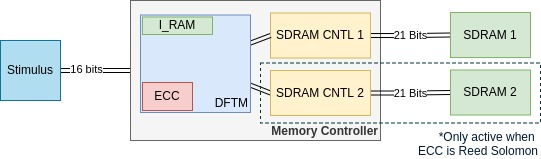

# DFTM Memory Controller

This repository is created to host the work I done for my PhD. 
It contains a Dynamic Fault Tolerance Module, Sdram controller and a small memory ram example.



All the designs are written in MyHDL which is a HDL written in Python. Details and manual to use MyHDL can be found on http://myhdl.org/ 
This version is based on source at https://github.com/udara28/SDRAM_Controller
## Pre-requirements ##

* Python 3
* MyHDL

## Instructions ##

All necessary To run the tests and convert the source can be execute from the makefile
```bash
make test_sdram_cntl 

make gen_vhdl_sdram_cntl
```
## Simulator ##

This folder contains a sdram modal. It has a similar interface to real sdram which is defined in the file sd_intf.py
The modal is closely simulating the sdram behaviour with the timing delays so that an sdram controller can be tested for functionality.

Simulator is simply a python dictionary wrapped with an interface similar to sdram hardware. Writing to sdram is equivalent to adding (addr,value) pair to the dictionary. This is a good example of using the power of python to write models that can verify the functionality of RTL designs. 

Simulator also has some built-in checks to detect any illegal commands or sequence of commands. If such a violation has happened simulator output will have messages in the form "SDRAM : [ERROR] error-message". If such messages are present in the output, the controller is not working properly. The error message can be used to detect and correct the faults in the controller.

### Simulator Output ###

This simulator prints several types of messages to the console.

| Output                                         | Description                                                                             |
|------------------------------------------------|-----------------------------------------------------------------------------------------|
|SDRAM : [COMMAND]  command-name                 | In every positive edge of the clock cycle sdram will print the current command issued. (This would appear only if show_command is set to True. Default is False) |
|STATE : [CHANGE] old-state -> new-state @  time | Each bank can be in different state. This would print the state transition and the time |
|DATA : [WRITE] Addr: addr  Data: value          | This print happens at the moment when data is written to the memory. There is a few cycle delay between the time write command appear in the pins and the time when actual data is written to the memory |
|STATE : [READ] Data Ready @  time               | This is a very important print. It appears when sdram start driving the data bus with the read value. Since the sdram will only drive the bus for a limited time the controller should extract the data right after this time |
|SDRAM : [ERROR] error-message                   | There are several self tests in the sdram. If this type of message appear in the output, controller is not functioning properly. error-message will give more information about the error. |

### Simulator Test ###

Simulator test is available in the file test/sdram_ctrl.py . This test can be run using the following command.
```bash
make test_sdram_cntl 
```
The test uses the transactors defined in sd_intf.py file to do the read and write. It manually drives the input ports of the sdram and read the value from inout port.  

## Controller ##

The controller is written refering the VHDL designed by xesscorp which can be found on https://github.com/xesscorp/VHDL_Lib/blob/master/SdramCntl.vhd

Sdram controller make it easy to access the sdram. The host logic can use the sdram more likely an sram because of the controller. It takes care of row refreshes and gives an easy to use interface for the host logic to access the sdram. Host side interface of the controller is availiable in the file host_intf.py


### Instructions ###

* WRITE : To perform write operation write the address to addr and the data to data_i and drive write_i high. Hold the values until done_o goes high.
* READ  : To perform read operation write the read address to addr and wait until don_o goes high. Read the value of data_o as soon as done_o goes high. 

* MyHDL allows to write transactors in the host_intf.py file where the host side interface is defined. Transactors further simplifies usage of the controller. With transactors read and write looks like follows

```python
        yield host_intf.write(120,23)
        yield host_intf.done_o.posedge

        yield host_intf.read(120)
        yield host_intf.done_o.posedge
        print "Data Value : ",host_intf.data_o
```

### Controller Test ###

Controller test is availiable in the file test_controller.py. This test can be run by the following command.
```bash
	python test_controller.py
```
The test uses the transactors defined in host_intf.py file to do the read and write. It manually drives the input ports of the controller and read the value from the output port.

### Convertion to Verilog and VHDL ###

MyHDL offeres a very simple interface to perform the conversion from MyHDL to either Verilog or VHDL. The file Converion.py uses these interfaces to generate both Verilog and VHDL convertions of the SdramCntl.py. Following command will generate MySdramCntl.v, MySdramCntl.vhd and pck_myhdl_10.vhd files.
```bash
make gen_vhdl_sdram_cntl
```
pck_myhdl_10.vhd is a VHDL library file which is required by MySdramCntl.vhd (The name of the file may change depends on the MyHDL version being used.)

The converted VHDL design has been verified on Xula2 board. Detailed step followed for the hardware verification can be found at http://design4hardware.blogspot.com/2015/08/detailed-steps-for-hardware.html

### Limitations ###

Sdram can be programmed to used in several different modes. However this controller does not allow to set up the sdram user mode. Instead it uses a fixed mode where burst length is one.